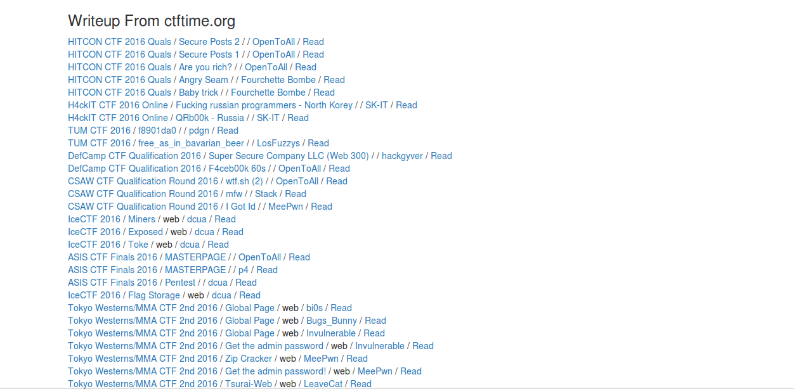

## CTFWriteupScrapper

Scrap all writeup from http://ctftime.org/ and organize which to read first.

run : `python runserver.py` to start the application.
listening at `127.0.0.1:31337`

## Requirment

- Flask
- BeautifulSoup
- urllib2
- mechanize

## Todo

- Add SQLite db
- Use datatables

## Screen Shoot

## License

MIT @abdilahrf
